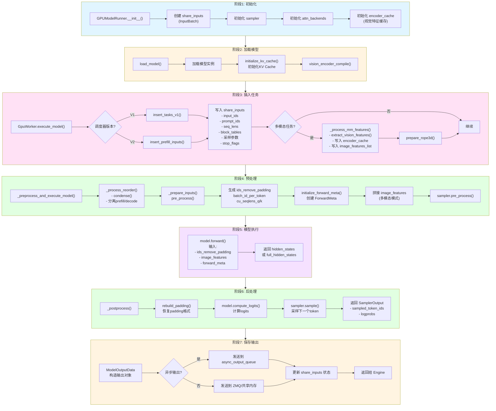
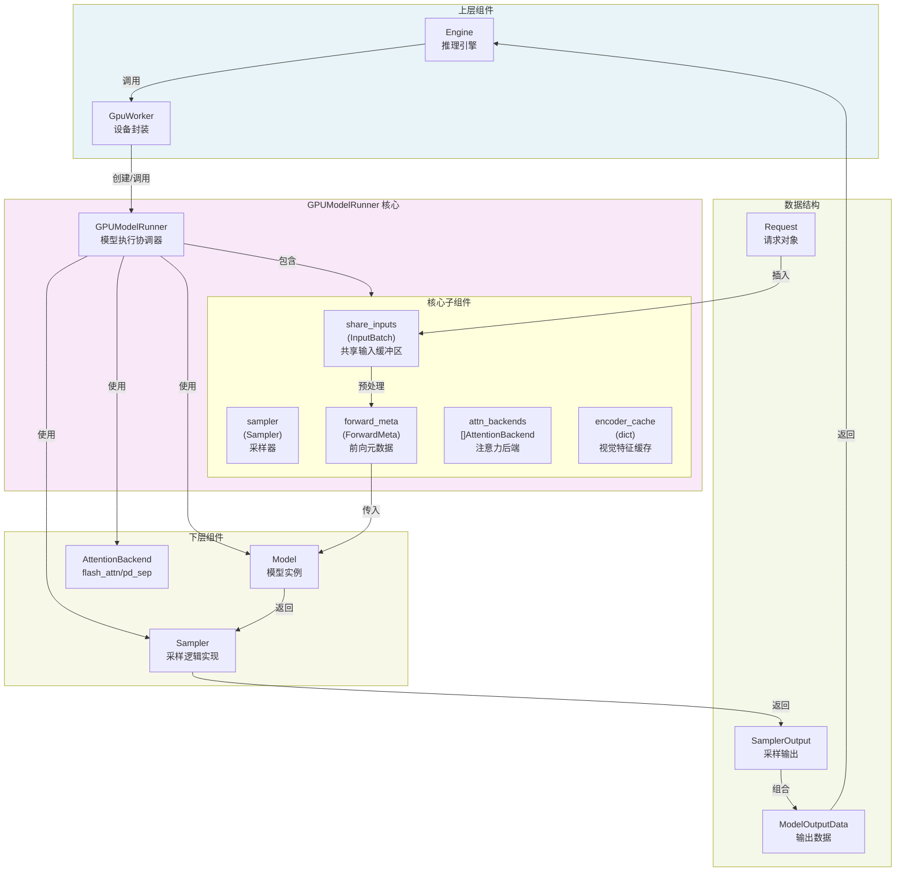
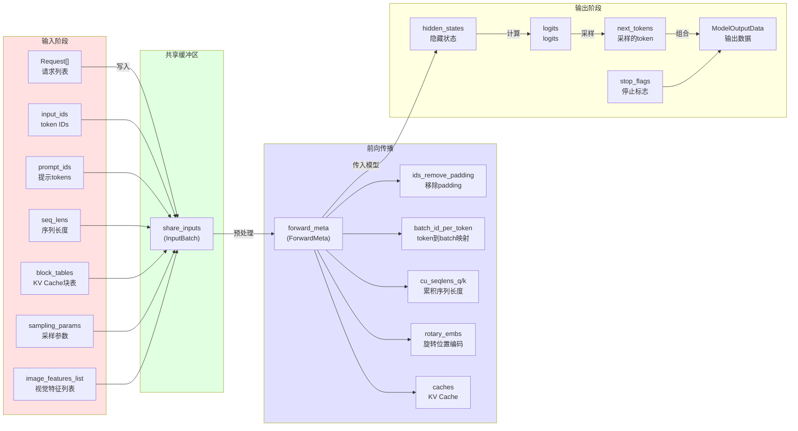

# GPU Model Runner 数据流转流程图

本文档描述了 FastDeploy 中 `GPUModelRunner` 组件的数据流转流程。

---

## 1. 完整数据流转流程图

---

## 2. 组件交互关系图

---

## 3. 数据结构流转图

---

## 4. 核心数据转换表

| 转换步骤 | 输入 | 输出 | 方法 |
|---------|------|------|------|
| 1 | Request[] | share_inputs | `insert_tasks_v1()` / `insert_prefill_inputs()` |
| 2 | share_inputs | forward_meta | `_prepare_inputs()` + `initialize_forward_meta()` |
| 3 | forward_meta + share_inputs | hidden_states | `model.forward()` |
| 4 | hidden_states | logits | `model.compute_logits()` |
| 5 | logits + share_inputs | SamplerOutput | `sampler.sample()` |
| 6 | SamplerOutput + share_inputs | ModelOutputData | `_postprocess()` + `_save_model_output()` |
| 7 | ModelOutputData | Engine/共享内存 | `post_process()` |

---

## 5. 核心类与方法

### GPUModelRunner
**文件**: `fastdeploy/worker/gpu_model_runner.py`

| 方法 | 描述 |
|------|------|
| `__init__()` | 初始化共享输入缓冲区、采样器、注意力后端 |
| `load_model()` | 加载模型实例、初始化KV Cache |
| `insert_tasks_v1()` | V1调度器：插入任务到共享输入 |
| `insert_prefill_inputs()` | V2调度器：插入prefill输入 |
| `_process_mm_features()` | 处理多模态特征 |
| `execute_model()` | 执行模型主入口 |
| `_preprocess_and_execute_model()` | 预处理并执行模型 |
| `_postprocess()` | 后处理模型输出 |

### InputBatch
**文件**: `fastdeploy/worker/input_batch.py`

| 属性 | 类型 | 描述 |
|------|------|------|
| input_ids | paddle.Tensor | 输入token IDs |
| prompt_ids | paddle.Tensor | 提示token IDs |
| seq_lens_encoder | paddle.Tensor | 编码器序列长度 |
| seq_lens_decoder | paddle.Tensor | 解码器序列长度 |
| block_tables | paddle.Tensor | KV Cache块表 |
| top_p, top_k | paddle.Tensor | 采样参数 |
| stop_flags | paddle.Tensor | 停止标志 |
| image_features | paddle.Tensor | 视觉特征 |

### ForwardMeta
**文件**: `fastdeploy/model_executor/forward_meta.py`

| 属性 | 类型 | 描述 |
|------|------|------|
| ids_remove_padding | paddle.Tensor | 移除padding的token IDs |
| rotary_embs | paddle.Tensor | 旋转位置编码 |
| attn_backend | AttentionBackend | 注意力后端 |
| block_tables | paddle.Tensor | 块表 |
| caches | list[paddle.Tensor] | KV缓存 |

### ModelOutputData
**文件**: `fastdeploy/worker/output.py`

| 属性 | 类型 | 描述 |
|------|------|------|
| next_tokens | paddle.Tensor | 下一个token |
| stop_flags | paddle.Tensor | 停止标志 |
| step_idx | int | 步骤索引 |
| seq_lens_this_time | paddle.Tensor | 当前步序列长度 |
| input_ids | paddle.Tensor | 输入IDs |
| full_hidden_states | paddle.Tensor | 完整隐藏状态 |

---

## 6. 文件路径索引

| 组件 | 文件路径 |
|------|----------|
| GPUModelRunner | `fastdeploy/worker/gpu_model_runner.py` |
| InputBatch | `fastdeploy/worker/input_batch.py` |
| ModelRunnerBase | `fastdeploy/worker/model_runner_base.py` |
| GpuWorker | `fastdeploy/worker/gpu_worker.py` |
| ModelOutputData | `fastdeploy/worker/output.py` |
| ForwardMeta | `fastdeploy/model_executor/forward_meta.py` |
| Sampler | `fastdeploy/model_executor/layers/sample/sampler.py` |
| Request | `fastdeploy/engine/request.py` |
